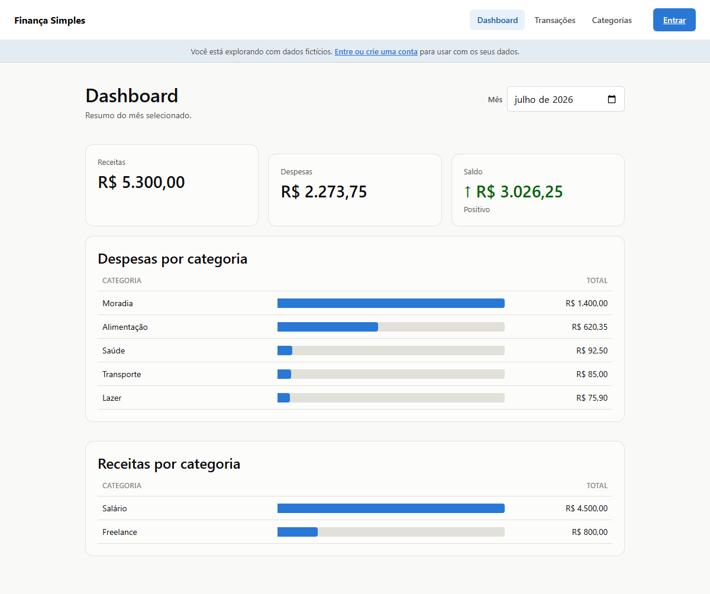
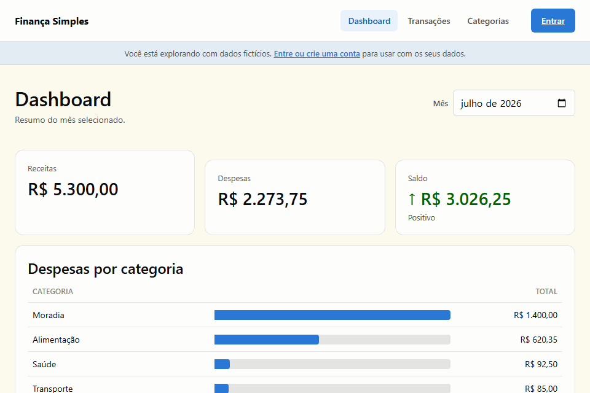
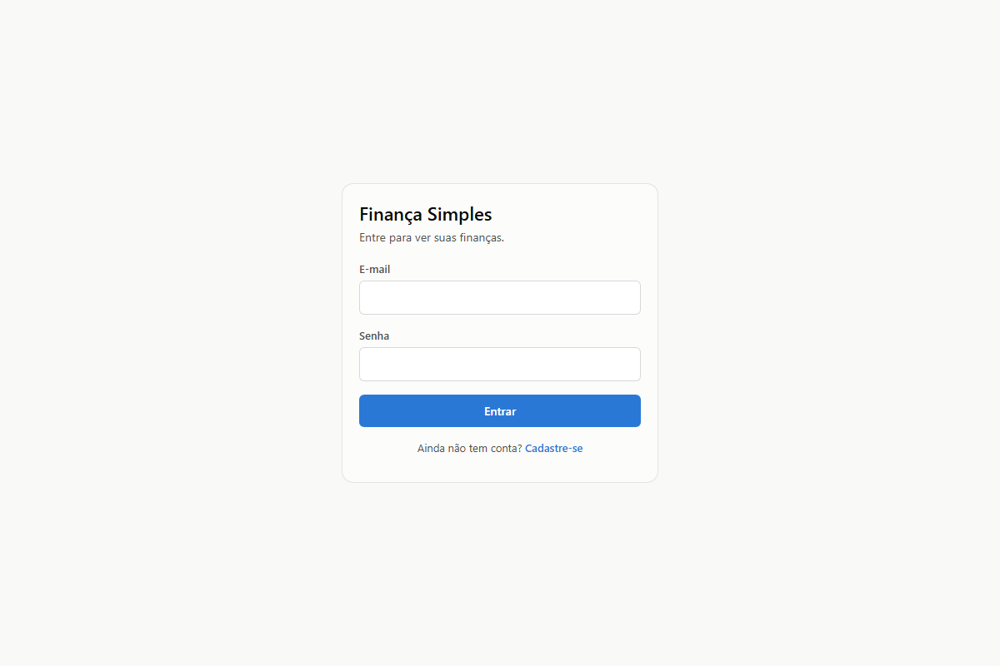
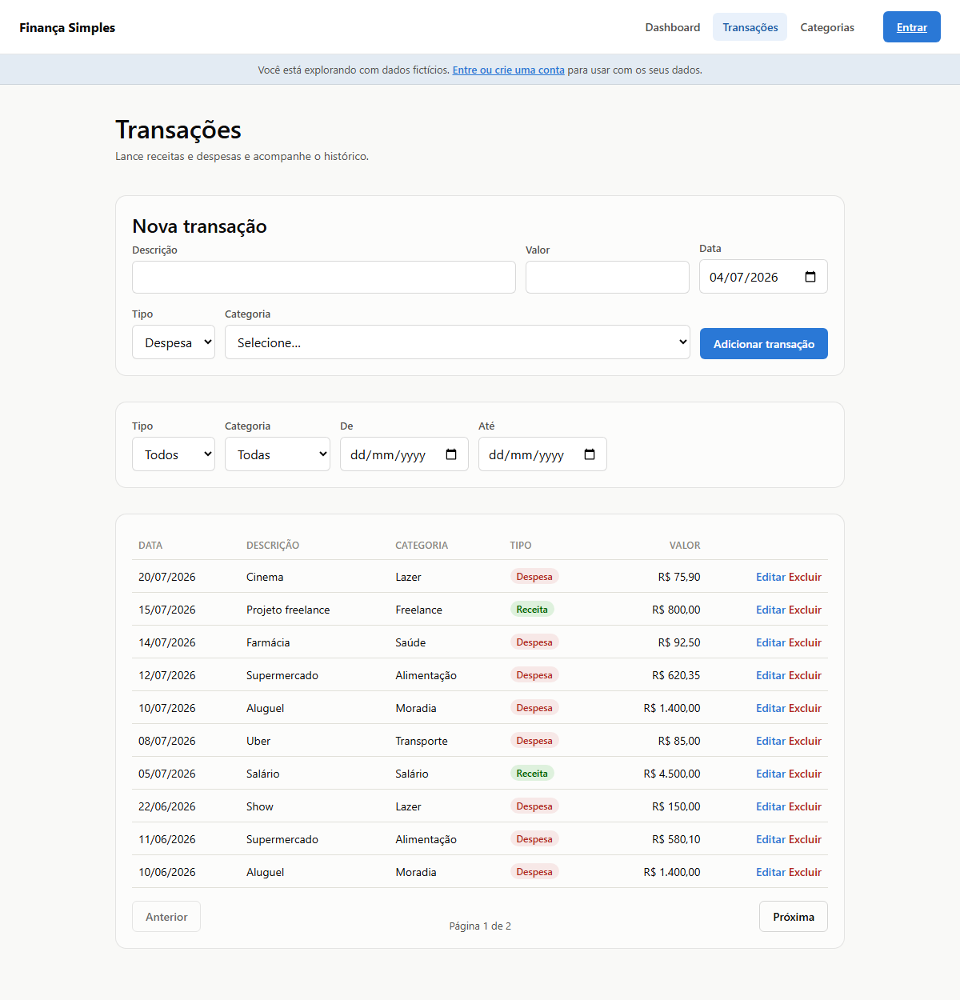
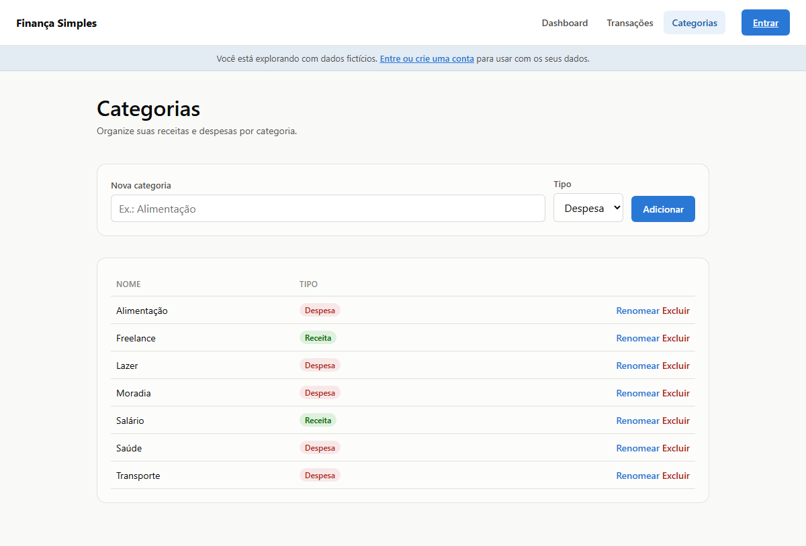

# Finança Simples

App fullstack de controle financeiro pessoal: cadastro de receitas e despesas, categorias, autenticação e dashboard com resumo visual.


**Demo:** _(link do deploy — adicionar aqui assim que disponível)_

Sem precisar criar conta: o app abre direto com dados fictícios (dá pra criar, editar e excluir à vontade) — veja a seção [Como usar](#como-usar) abaixo.



## Sumário

- [Funcionalidades](#funcionalidades)
- [Como usar](#como-usar)
- [Stack](#stack)
- [Estrutura](#estrutura)
- [Rodando localmente](#rodando-localmente)
- [Deploy](#deploy)
- [Decisões técnicas](#decisões-técnicas)
- [Progresso](#progresso)

## Funcionalidades

- Cadastro e login com JWT em cookie `httpOnly`, refresh token e rate limiting nas rotas de auth
- CRUD de categorias (receita/despesa) e transações, com filtros por tipo, categoria e período, e paginação
- Dashboard com receita/despesa/saldo do mês e ranking de gastos por categoria
- Todo dado é isolado por usuário — uma conta nunca vê ou edita o que é de outra
- Modo demonstração: sem login, as telas já vêm com dados fictícios e CRUD funcional (só não persiste)

## Como usar



Abra o app e mexa direto — Dashboard, Transações e Categorias já vêm com dados de exemplo, sem pedir login. Criar, editar e excluir funciona normalmente, só que fica na memória do navegador (some ao recarregar a página).

Pra usar com dados reais, faça login com a conta demo (`demo@financasimples.dev` / `demo1234`) ou crie uma conta — as mesmas telas passam a mostrar só os seus dados.

<details>
<summary>Mais telas</summary>

| Login | Transações | Categorias |
|---|---|---|
|  |  |  |

</details>

## Stack

- **Backend:** Node.js + Express 5 + TypeScript, Prisma (PostgreSQL), Zod, JWT + bcrypt
- **Frontend:** React + Vite + TypeScript, React Router
- **Testes:** Vitest + Supertest (17 testes de auth, categorias e transações)
- **Deploy:** Vercel (frontend e backend no mesmo projeto, via [Services](https://vercel.com/docs/services)) + Neon (Postgres)

Plano completo do projeto, incluindo modelagem de banco e decisões de segurança, em [docs/PLANO.md](docs/PLANO.md).

## Estrutura

```
├── backend/      # API REST (Express + Prisma) + testes (Vitest)
├── frontend/     # SPA (React + Vite)
├── docs/         # Plano, decisões e screenshots do projeto
└── vercel.json   # roteamento: /api/* → backend, resto → frontend
```

## Rodando localmente

**Pré-requisitos:** Node.js 20+ e um PostgreSQL (local ou um free tier como [Neon](https://neon.tech)).

### Backend

```bash
cd backend
cp .env.example .env   # ajuste DATABASE_URL/DIRECT_URL e gere segredos JWT
npm install
npx prisma migrate deploy  # aplica a migration inicial (já versionada)
npm run db:seed            # cria usuário demo + categorias + transações
npm run dev                 # API em http://localhost:3333
```

Usando Neon/Supabase: `DATABASE_URL` é a connection string do **pooler** (com `pgbouncer=true`), usada pela aplicação em runtime; `DIRECT_URL` é a conexão **direta**, usada só pelo Prisma Migrate — DDL e advisory locks não funcionam de forma confiável através de PgBouncer em modo transaction. Rodando Postgres local sem pooler, as duas variáveis apontam para a mesma URL.

Usuário demo criado pelo seed: `demo@financasimples.dev` / senha `demo1234`.

Health check: `GET http://localhost:3333/api/v1/health`

### Testes

```bash
cd backend
npm test   # Vitest: auth, categorias e transações
```

Os testes sobem a API real (rotas → controllers → services) com os repositories trocados por fakes em memória — não precisam de Postgres nem de rede, então rodam do mesmo jeito local ou em CI.

### Frontend

```bash
cd frontend
npm install
npm run dev             # SPA em http://localhost:5173
```

## Deploy

Frontend e backend são publicados como um projeto único na Vercel usando [Services](https://vercel.com/docs/services): o `vercel.json` na raiz define dois serviços (`frontend`, Vite; `backend`, Express) e roteia `/api/*` para o backend e o resto para o frontend — os dois ficam no mesmo domínio.

1. Importe o repositório na Vercel apontando a **raiz do monorepo** (não uma subpasta).
2. Configure as variáveis de ambiente do projeto (usadas pelo serviço `backend`):
   - `DATABASE_URL`, `DIRECT_URL` (Neon — ver `backend/.env.example`)
   - `JWT_SECRET`, `JWT_REFRESH_SECRET`
   - `NODE_ENV=production` (a Vercel já define isso automaticamente em produção)
3. Deploy. O build do backend roda `npx prisma generate` (definido em `vercel.json`) — o Prisma Client precisa ser gerado na própria máquina de build da Vercel (Linux), não reaproveitar o gerado localmente no Windows.
4. Rode a migration contra o banco de produção uma vez, localmente: `DATABASE_URL=<direct-do-neon> npx prisma migrate deploy` (dentro de `backend/`).

Como frontend e backend ficam no mesmo domínio (same-origin), **não é preciso configurar `VITE_API_URL`** em produção — o client HTTP do frontend já usa caminho relativo quando a variável não aponta para `localhost`.

## Decisões técnicas

- **`Decimal`, nunca `Float`, para dinheiro.** Ponto flutuante binário não representa valores monetários com exatidão (`0.1 + 0.2 !== 0.3`); o schema usa `Decimal(10,2)` e a aritmética do dashboard passa pelo tipo `Decimal` do Prisma, nunca por `Number` bruto.
- **JWT em cookie `httpOnly`, não em `localStorage`.** Protege contra roubo de token via XSS — um script injetado na página não consegue ler o cookie.
- **Toda query de `categories`/`transactions` filtrada pelo `userId` do token, nunca do body.** Impede que um usuário autenticado acesse ou edite dado de outro só adivinhando um ID.
- **Frontend e backend no mesmo domínio (Vercel Services), não em domínios separados.** Elimina CORS entre eles e permite `SameSite=Strict` no cookie sem fricção — a alternativa (backend num host, frontend em outro) exigiria `SameSite=None` ou configuração extra de CORS com credentials, superfície de ataque maior pra um ganho nenhum aqui.
- **Sem Chart.js no dashboard.** O gráfico de despesas/receitas por categoria é uma tabela HTML real (`<table>`) com uma barra desenhada em CSS por linha — não canvas. Isso dá acessibilidade de graça (leitor de tela lê categoria + valor normalmente, sem precisar de um toggle "ver como tabela" separado) e evita uma dependência só para um gráfico de barras horizontal. A cor da barra (`#2a78d6` claro / `#3987e5` escuro) foi validada contra contraste, banda de luminosidade e croma antes de entrar no código.
- **Dados fictícios no lugar de exigir login.** Quem visita o app sem conta vê o Dashboard/Transações/Categorias populados com dados de exemplo, com CRUD funcionando em memória (`frontend/src/services/demo.ts`) — sem tocar a API real nem persistir nada. Ao logar, as mesmas páginas trocam para os dados reais do usuário. Existe pra quem só quer clicar e ver o app funcionando, sem precisar criar conta antes.
- **Testes de integração com repository fake, não um Postgres de teste.** A arquitetura em camadas (`routes → controllers → services → repositories`) dá um ponto de substituição natural: os testes trocam os `repositories` por uma versão em memória (`backend/tests/support/fake-repositories.ts`) e batem na API real por cima disso via Supertest. Cobre toda a regra de negócio (validação, autorização por `userId`, mensagens de erro) sem precisar subir/limpar um banco a cada run — o trade-off consciente é não testar o SQL gerado pelo Prisma em si.

## Progresso

- [x] Setup do projeto, schema Prisma, migration inicial, seed de teste
- [x] Auth (registro, login, refresh, logout, me) + middleware de autenticação + rate limiting
- [x] CRUD de categorias e transações + validação Zod
- [x] Endpoints de dashboard (agregações)
- [x] Frontend: login, transações, formulários, gráficos, modo demonstração
- [x] Deploy (Vercel Services + Neon)
- [x] Testes automatizados (auth, categorias, transações — 17 testes via Vitest)
